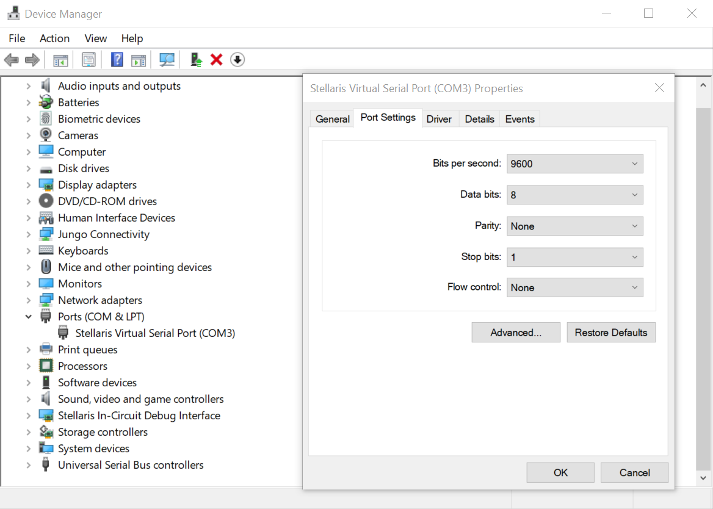
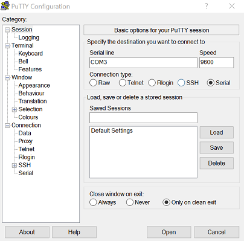
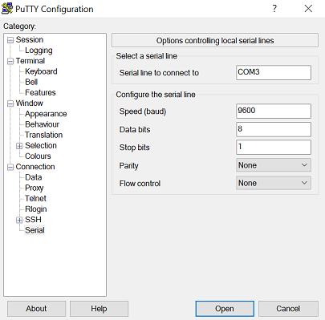
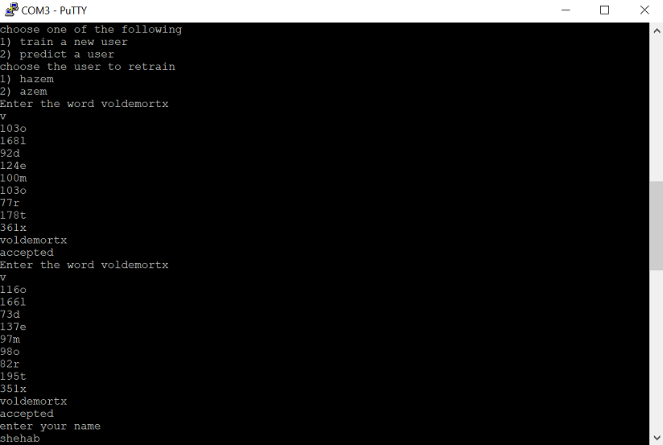
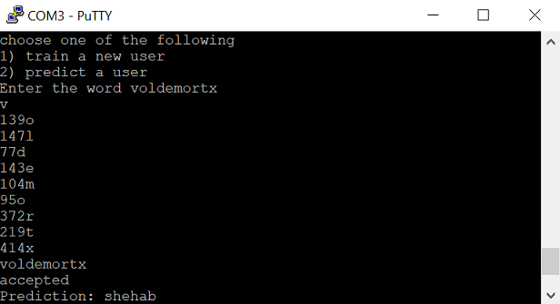

# KeyStroke-identification-using-Tiva-c
Identifying users using decision tree based on the way they type a keyword
### Running the project
connect tiva c to computer and turn it on

open device manger & look under ports and take note of which com the tiva c is connected to

right click on stellaris and open properties & then click on the details tab.

open putty or any serial terminal and input the details above.

### Training
To train choose the first option and then choose the user to train in place of and enter the given word for specified number of times

### Identification
To identify choose the second option and write the the given word

### Demo video
 
[Watch the video](https://youtu.be/gt07rcfA7io)
