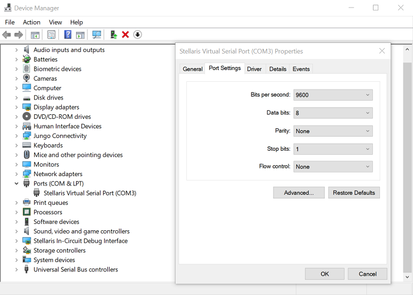

# KeyStroke-identification-using-Tiva-c
Identifying users based on the way they type a keyword
### Running the project
connect tiva c to computer and turn it on

open device manger & look under ports and take note of which com the tiva c is connected to

right click on stellaris and open properties & then click on the details tab.

open putty or any serial terminal and input the details above.

